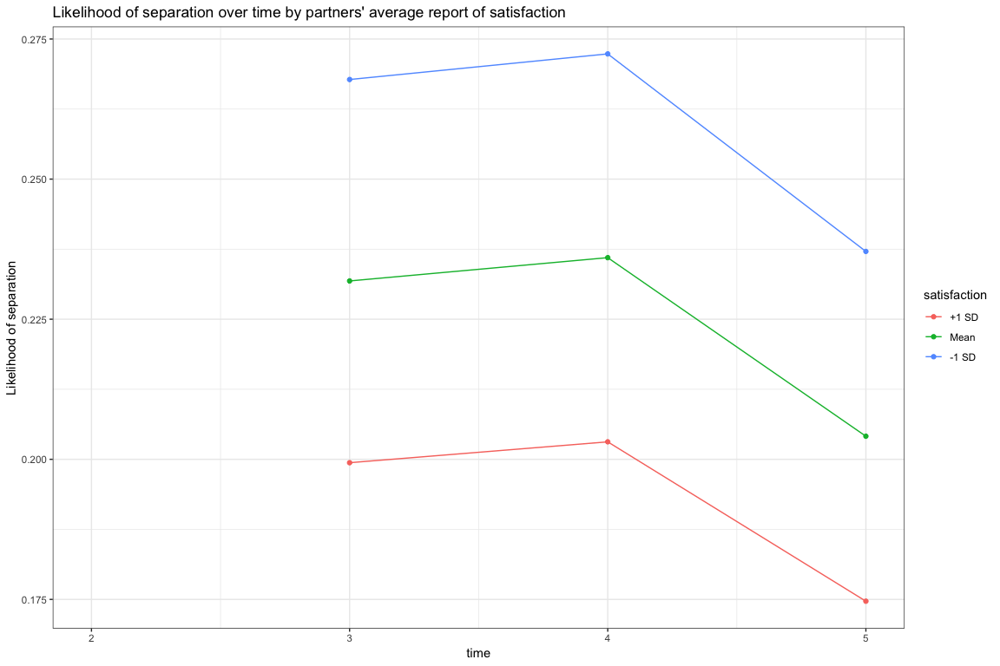

# Summary

* Mothers' reports of conflict and satisfaction are associated with separation, but these predictors do not interact.
* Fathers' reports of conflict (but not satisfaction) are associated with separation.
* Couples' average (from both partners) reports of conflict and satisfaction are associated with separation, but these predictors do not interact.
* The standard deviation of couples' reports of satisfaction (i.e., their level of disagreement over how satisfied they are) is associated with separation. No association found for SD of conflict.
* No 2-way interactions between the mean and sd of couples' satisfaction and conflict reports.
* Two 3-way interactions between these terms, but these are only significant when in the model together so I don't put too much stock in them.

# Reading in and reshaping data


```r
knitr::opts_chunk$set(echo = TRUE,
                      warning = FALSE,
                      message = FALSE,
                      fig.path = "rel-continuation-figs/",
                      fig.width = 12,
                      fig.height = 8)
# data prep
library(haven)
library(ggplot2)
library(dplyr)
```

```
## 
## Attaching package: 'dplyr'
```

```
## The following objects are masked from 'package:stats':
## 
##     filter, lag
```

```
## The following objects are masked from 'package:base':
## 
##     intersect, setdiff, setequal, union
```

```r
library(reshape2)
library(stringr)
library(survival)
library(tidyr)
```

```
## 
## Attaching package: 'tidyr'
```

```
## The following object is masked from 'package:reshape2':
## 
##     smiths
```

```r
#
theme_set(theme_bw())
# read in
thedata <- read_sav("/Users/Ben/Dropbox/PhD/Research/CCHN-relationship-continuation/171015Data-for-Ben.sav")
##
# identify those together at t1
##
# relationship status legend
# t1 legend m112_1000:
# 1 is married
# 2 is not married but together
# 3 is not married and not together
# 10 is father is deceased
# 98 is don't know
# 99 is refused to respond
thedata <- thedata %>%
  mutate(together.t1 = ifelse(m112_1000 %in% 1:2, 1, 0))
##
# identifying those together at t2:5
##
# relationship update legend
##
# 1 is moved in together
# 2 is no longer living together
# 3 is got married
# 4 is now separated
# 5 is now divorced
# 6 is broke up
# 7 is got back together
# 8 is no change
# 9 is other change
# 10 is father deceased
# 11 is engaged
# 98 is don't know
# 99 is refused to respond
##
# the selection is:
##
# for time t(n)
# if not together at t(n-1)
# and changed by moving in, marrying, back together or engaged
# then together at tn
# if together at t(n-1)
# and no change
# then together at tn
# all else then not together at tn
##
# identify those together at t2
##
# m201_1630 was there a change?
# m201_1640 if yes, what change?
thedata <- thedata %>%
  mutate(together.t2 = case_when(together.t1 == 0 &
                                   m201_1630 == 1 &
                                   m201_1640 %in% c(1, 3, 7, 11) ~ 1,
                                 together.t1 == 1 & m201_1630 == 0 ~ 1,
                                 TRUE ~ 0))
##
# identify those together at t3
##
# m301_1240 was there any changes?
# m301_1250 if yes, what change?
thedata <- thedata %>%
  mutate(together.t3 = case_when(together.t2 == 0 &
                                   m301_1240 == 1 &
                                   m301_1250 %in% c(1, 3, 7, 11) ~ 1,
                                 together.t2 == 1 & m301_1240 == 0 ~ 1,
                                 TRUE ~ 0))
##
# identify those together at t4
##
# m401_1240 was there any changes?
# m401_1250 if yes, what change?
thedata <- thedata %>%
  mutate(together.t4 = case_when(together.t3 == 0 &
                                   m401_1240 == 1 &
                                   m401_1250 %in% c(1, 3, 7, 11) ~ 1,
                                 together.t3 == 1 & m401_1240 == 0 ~ 1,
                                 TRUE ~ 0))
##
# identify those together at t5
##
# m501_1240 was there any changes?
# m501_1250 if yes, what change?
thedata <- thedata %>%
  mutate(together.t5 = case_when(together.t4 == 0 &
                                   m501_1240 == 1 &
                                   m501_1250 %in% c(1, 3, 7, 11) ~ 1,
                                 together.t4 == 1 & m501_1240 == 0 ~ 1,
                                 TRUE ~ 0))
# Kharah, per your comments in the kmr.comments variable, I'm excluding any of the participants that you flagged
thedata <- thedata %>% filter(str_length(kmr.comments) == 0)
# filtering to include only participants who were together at t2
thedata <- thedata %>% filter(together.t2 == 1)  # 1151 participants
##
# reshape the data to have event times and censoring
##
thedata <- thedata %>%
  mutate(separation.time = case_when(together.t3 == 0 ~ 3,
                                     together.t4 == 0 ~ 4,
                                     together.t5 == 0 ~ 5,
                                     together.t5 == 1 ~ 5),
         censored = ifelse(together.t5 == 1 & separation.time == 5, 1, 0))
##
# reshaping predictors
##
# centering
thedata <- thedata %>% mutate_at(vars(starts_with("fDAS"),
                                      starts_with("mDAS"),
                                      starts_with("cmean")),
                                 funs(c = scale(.)))
```

```
## Warning: funs() is soft deprecated as of dplyr 0.8.0
## please use list() instead
## 
## # Before:
## funs(name = f(.)
## 
## # After: 
## list(name = ~f(.))
## This warning is displayed once per session.
```

```r
# computing couple level means and sd
thedata <- thedata %>%
  rowwise() %>%
  mutate(cmean.conflict = mean(c(fDAS.conflict, mDAS.conflict)),
         cmean.pos = mean(c(fDAS.pos.sat, mDAS.pos.sat)),
         cmean.conflict_c = mean(c(fDAS.conflict_c, mDAS.conflict_c)),
         cmean.pos_c = mean(c(fDAS.pos.sat_c, mDAS.pos.sat_c)),
         csd.conflict = sd(c(fDAS.conflict, mDAS.conflict)),
         csd.pos = sd(c(fDAS.pos.sat, mDAS.pos.sat))) %>%
  ungroup() %>%
  mutate_at(vars(starts_with("csd")),
            funs(c = scale(., scale = FALSE)))
# spot check
# select(thedata, starts_with("together"), separation.time, censored) %>%
  # filter(together.t4 == 0 & together.t5 == 1)
##
# generating person period format
##
pp.data <- thedata %>%
  select(subjid, separation.time, censored) %>%
  mutate(separation.t2 = 0,
         separation.t3 = case_when(separation.time == 3 ~ 1,
                                   TRUE ~ 0),
         separation.t4 = case_when(separation.time == 4 ~ 1,
                                   separation.time > 4 ~ 0,
                                   TRUE ~ NA_real_),
         separation.t5 = case_when(separation.time == 5 & censored == 0 ~ 1,
                                   separation.time == 5 & censored == 1 ~ 0,
                                   TRUE ~ NA_real_)) %>%
  gather(time, separation, -c(subjid, censored, separation.time)) %>%
  arrange(subjid) %>%
  filter(!is.na(separation)) %>%
  mutate(timen = as.numeric(str_sub(time, start = -1))) %>%
  left_join(select(thedata,
                   subjid,
                   contains("DAS"),
                   starts_with("cmean"),
                   starts_with("csd"),
                   parity,
                   mother_age,
                   father_age,
                   income = per_capita_hh_income_m),
                   by = "subjid")
# function to generat hazard tables and ci
# this is separate so we only have to compute cis once
make.initial.hazard <- function(the.fit) {
  tibble(time = 3:5,
         logit = the.fit$coefficients[1:3],
         ci.low = confint(the.fit)[1:3, 1],
         ci.high = confint(the.fit)[1:3, 2])
}
# function to generate hazard tables for main effects
make.hazard.me <- function(the.fit,
                           the.initial.hazard,
                           the.main.effect,
                           main.effect.level,
                           main.effect.label) {
  main.effect.val <- the.fit$coefficients[the.main.effect] * main.effect.level
  the.hazard <- the.initial.hazard %>%
    mutate_at(vars(logit, ci.low, ci.high),
                 funs(. + main.effect.val)) %>%
    mutate(main.effect = main.effect.label) %>%
    mutate_at(vars(logit, ci.low, ci.high),
              funs(odds = exp(.),
                   hazard = exp(.)/(1 + exp(.)))) %>%
    rename(ci.low_logit = ci.low,
           ci.high_logit = ci.high,
           odds = logit_odds,
           hazard = logit_hazard) %>%
    mutate(survival = cumprod(1 - hazard)) %>%
    select(time, main.effect, survival, matches("hazard"), everything()) %>%
    bind_rows(tibble(time = 2,
                     survival = 1,
                     main.effect = main.effect.label))
  the.hazard
}
hazard.main.effect <- function(the.fit,
                               the.main.effect) {
  the.initial.hazard <- make.initial.hazard(the.fit)
  fit.hazard.mean <- make.hazard.me(the.fit,
                                    the.initial.hazard,
                                    the.main.effect,
                                    main.effect.level = 0,
                                    main.effect.label = "Mean")
  fit.hazard.low <- make.hazard.me(the.fit,
                                   the.initial.hazard,
                                   the.main.effect,
                                   main.effect.level = -1,
                                   main.effect.label = "-1 SD")
  fit.hazard.high <- make.hazard.me(the.fit,
                                    the.initial.hazard,
                                    the.main.effect,
                                    main.effect.level = +1,
                                    main.effect.label = "+1 SD")
  fit.hazard <- bind_rows(fit.hazard.mean,
                          fit.hazard.low,
                          fit.hazard.high) %>%
    select(time, main.effect, survival, matches("hazard"), everything()) %>%
    mutate(main.effect = factor(main.effect,
                                levels = c("+1 SD",
                                           "Mean",
                                           "-1 SD")))
  fit.hazard
}
# function to generate hazard tables for interactions
# testing hazard.int(fit.c5, 4:7, 8:15)
make.hazard.int <- function(the.fit,
                            the.initial.hazard,
                            effect.val,
                            the.var.names,
                            the.var.levels){
  the.hazard <- the.initial.hazard %>%
    mutate_at(vars(logit, ci.low, ci.high),
                 funs(. + effect.val))
  var.labels <- tibble(time = 3:5)
  for(i in 1:length(the.var.names)){
    var.labels <- bind_cols(var.labels,
                            tibble(rep(the.var.levels[i], 3)))
  }
  names(var.labels)[-1] <- the.var.names
  the.hazard <- left_join(the.hazard, var.labels, by = "time") %>%
    mutate_at(vars(logit, ci.low, ci.high),
              funs(odds = exp(.),
                   hazard = exp(.)/(1 + exp(.)))) %>%
    rename(ci.low_logit = ci.low,
           ci.high_logit = ci.high,
           odds = logit_odds,
           hazard = logit_hazard) %>%
    mutate(survival = cumprod(1 - hazard)) %>%
    select(time, the.var.names, survival, matches("hazard"), everything())
surv1 <- tibble(time = 2,
                survival = 1) %>%
  bind_cols(select(var.labels, -time)[1,])
bind_rows(the.hazard, surv1)
}
hazard.int <-function(the.fit, the.main.effects, the.interactions){
  the.initial.hazard <- make.initial.hazard(the.fit)
  # permutations for main effects
  permute.me <- expand.grid(rep(list(-1:1),
                                  length(the.main.effects)))
  # permutations for interactions
  fit.coefs <- the.fit$coefficients
  permute.int <- tibble()
  for (i in 1:length(the.interactions)){
    int.term <- names(fit.coefs)[the.interactions[i]]
    the.terms <- unlist(str_split(int.term, ":"))
    term.positions <- match(the.terms, names(fit.coefs)) %>%
      match(the.main.effects)
    int.indicator <- permute.me[, term.positions] %>%
      apply(1, prod) %>%
      tibble()
    if (length(permute.int) == 0) {
      permute.int <- int.indicator
    } else {
      permute.int <- bind_cols(permute.int, int.indicator)
    }
  }
  names(permute.int) <- paste0("int", the.interactions)
  # create hazard tables
  the.hazard.tables <- tibble()
  for (i in 1:nrow(permute.me)) {
    effect.val <- sum(fit.coefs[the.main.effects] * permute.me[i, ],
                      fit.coefs[the.interactions] * permute.int[i, ])
    the.var.levels <- permute.me[i, ] %>%
      factor(levels = -1:1, labels = c("-1 SD", "Mean", "+1 SD"))
    temp.hazard <- make.hazard.int(the.fit,
                                   the.initial.hazard,
                                   effect.val,
                                   names(fit.coefs[the.main.effects]),
                                   the.var.levels)
    if (length(the.hazard.tables) == 0) {
      the.hazard.tables <- temp.hazard
    } else {
      the.hazard.tables <- bind_rows(the.hazard.tables, temp.hazard)
    }
  }
  the.hazard.tables
}
# Counting Ns
# Mom's, no covariates
md1 <- pp.data %>%
  select(subjid, separation, mDAS.conflict, mDAS.pos.sat, timen) %>%
  filter(timen > 2) %>%
  filter(complete.cases(.))
# N obs: 2518
nrow(md1)
```

```
## [1] 2518
```

```r
# N subjects: 1103
unique(md1$subjid) %>% length()
```

```
## [1] 1103
```

```r
# Mom's, with covariates
md2 <- pp.data %>%
  select(subjid, separation, mDAS.conflict, mDAS.pos.sat, timen,
         mother_age, father_age, income, parity) %>%
  filter(timen > 2) %>%
  filter(complete.cases(.))
# N obs: 1653
nrow(md2)
```

```
## [1] 1653
```

```r
# N subjects: 700
unique(md2$subjid) %>% length()
```

```
## [1] 700
```

```r
# Dad's no covariates
fd1 <- pp.data %>%
  select(subjid, separation, fDAS.conflict, fDAS.pos.sat, timen) %>%
  filter(timen > 2) %>%
  filter(complete.cases(.))
# N obs: 1583
nrow(fd1)
```

```
## [1] 1583
```

```r
# N subjects: 673
unique(fd1$subjid) %>% length()
```

```
## [1] 673
```

```r
# Dad's no covariates
fd2 <- pp.data %>%
  select(subjid, separation, fDAS.conflict, fDAS.pos.sat, timen,
         mother_age, father_age, income, parity) %>%
  filter(timen > 2) %>%
  filter(complete.cases(.))
# N obs: 1492
nrow(fd2)
```

```
## [1] 1492
```

```r
# N subjects: 633
unique(fd2$subjid) %>% length()
```

```
## [1] 633
```

# discrete time survival analyses

## plotting observed survival and hazard functions

To start, here are the hazard and survival functions for the entire data set, with no added predictors.


```r
ts <- survfit(Surv(separation.time, 1-censored) ~ 1, conf.type = "none", data = thedata)
emp.hazard <- with(ts, tibble(time, surv, n.event, n.risk))
emp.hazard <- emp.hazard %>%
  mutate(hazard = n.event/n.risk) %>%
  add_row(time = 2, surv = 1, n.event = 0, n.risk = nrow(thedata), hazard = NA)
ggplot(emp.hazard, aes(x = time, y = hazard)) +
  geom_line() +
  geom_point() +
  labs(y = "Likelihood of separation") +
  ggtitle("Likelihood of separation over time")
```

<!-- -->

```r
ggplot(emp.hazard, aes(x = time, y = surv)) +
  geom_line() +
  geom_point() +
  labs(y = "Proportion of Couples not Separated") +
  ggtitle("Couples' separation over time")
```

<!-- -->

## fitting a model to test association of mothers' reports

Mothers' reports of conflict and satisfaction are associated with separation, however these predictors do not interact. This pattern remains significant over and above associations with parity, income and age.


```r
# fit moms predictors
fit.m1 <- glm(separation ~ - 1 + factor(timen) + mDAS.conflict_c +
                mDAS.pos.sat_c + mDAS.conflict_c:mDAS.pos.sat_c,
              family="binomial", data=filter(pp.data, timen > 2))
summary(fit.m1)
```

```
## 
## Call:
## glm(formula = separation ~ -1 + factor(timen) + mDAS.conflict_c + 
##     mDAS.pos.sat_c + mDAS.conflict_c:mDAS.pos.sat_c, family = "binomial", 
##     data = filter(pp.data, timen > 2))
## 
## Deviance Residuals: 
##     Min       1Q   Median       3Q      Max  
## -1.0627  -0.7716  -0.6726  -0.5186   2.0960  
## 
## Coefficients:
##                                Estimate Std. Error z value Pr(>|z|)    
## factor(timen)3                 -0.96507    0.07147 -13.504  < 2e-16 ***
## factor(timen)4                 -1.15016    0.08681 -13.250  < 2e-16 ***
## factor(timen)5                 -1.33432    0.10417 -12.809  < 2e-16 ***
## mDAS.conflict_c                 0.22680    0.05673   3.998 6.39e-05 ***
## mDAS.pos.sat_c                 -0.17716    0.06045  -2.930  0.00338 ** 
## mDAS.conflict_c:mDAS.pos.sat_c  0.06026    0.04026   1.497  0.13440    
## ---
## Signif. codes:  0 '***' 0.001 '**' 0.01 '*' 0.05 '.' 0.1 ' ' 1
## 
## (Dispersion parameter for binomial family taken to be 1)
## 
##     Null deviance: 3490.7  on 2518  degrees of freedom
## Residual deviance: 2730.1  on 2512  degrees of freedom
##   (92 observations deleted due to missingness)
## AIC: 2742.1
## 
## Number of Fisher Scoring iterations: 4
```

```r
# interaction is not significant, so dropping
fit.m2 <- glm(separation ~ - 1 + factor(timen) + mDAS.conflict_c +
                mDAS.pos.sat_c, family="binomial",
              data=filter(pp.data, timen > 2))
summary(fit.m2)
```

```
## 
## Call:
## glm(formula = separation ~ -1 + factor(timen) + mDAS.conflict_c + 
##     mDAS.pos.sat_c, family = "binomial", data = filter(pp.data, 
##     timen > 2))
## 
## Deviance Residuals: 
##     Min       1Q   Median       3Q      Max  
## -1.2534  -0.7572  -0.6771  -0.5534   2.0316  
## 
## Coefficients:
##                 Estimate Std. Error z value Pr(>|z|)    
## factor(timen)3  -0.99610    0.06850 -14.542  < 2e-16 ***
## factor(timen)4  -1.18177    0.08434 -14.013  < 2e-16 ***
## factor(timen)5  -1.36747    0.10195 -13.413  < 2e-16 ***
## mDAS.conflict_c  0.21196    0.05603   3.783 0.000155 ***
## mDAS.pos.sat_c  -0.13963    0.05551  -2.515 0.011896 *  
## ---
## Signif. codes:  0 '***' 0.001 '**' 0.01 '*' 0.05 '.' 0.1 ' ' 1
## 
## (Dispersion parameter for binomial family taken to be 1)
## 
##     Null deviance: 3490.7  on 2518  degrees of freedom
## Residual deviance: 2732.4  on 2513  degrees of freedom
##   (92 observations deleted due to missingness)
## AIC: 2742.4
## 
## Number of Fisher Scoring iterations: 4
```

```r
# m conflict and m pos are significant
# still significant with controls for parity, income, and age
fit.m2.1 <- glm(separation ~ - 1 + factor(timen) + mDAS.conflict_c +
                mDAS.pos.sat_c + parity + income + mother_age + father_age,
                family="binomial",
              data=filter(pp.data, timen > 2))
summary(fit.m2.1)
```

```
## 
## Call:
## glm(formula = separation ~ -1 + factor(timen) + mDAS.conflict_c + 
##     mDAS.pos.sat_c + parity + income + mother_age + father_age, 
##     family = "binomial", data = filter(pp.data, timen > 2))
## 
## Deviance Residuals: 
##     Min       1Q   Median       3Q      Max  
## -1.1763  -0.7409  -0.6342  -0.5065   2.1561  
## 
## Coefficients:
##                   Estimate Std. Error z value Pr(>|z|)  
## factor(timen)3  -6.853e-02  3.191e-01  -0.215   0.8299  
## factor(timen)4   8.419e-03  3.250e-01   0.026   0.9793  
## factor(timen)5  -1.465e-01  3.360e-01  -0.436   0.6628  
## mDAS.conflict_c  1.559e-01  7.446e-02   2.093   0.0363 *
## mDAS.pos.sat_c  -1.723e-01  7.593e-02  -2.269   0.0233 *
## parity          -7.706e-02  8.665e-02  -0.889   0.3738  
## income          -1.366e-06  2.808e-06  -0.486   0.6267  
## mother_age      -1.767e-02  1.687e-02  -1.047   0.2950  
## father_age      -2.065e-02  1.382e-02  -1.495   0.1350  
## ---
## Signif. codes:  0 '***' 0.001 '**' 0.01 '*' 0.05 '.' 0.1 ' ' 1
## 
## (Dispersion parameter for binomial family taken to be 1)
## 
##     Null deviance: 2291.5  on 1653  degrees of freedom
## Residual deviance: 1708.1  on 1644  degrees of freedom
##   (957 observations deleted due to missingness)
## AIC: 1726.1
## 
## Number of Fisher Scoring iterations: 4
```

## visualizing association of mothers' conflict reports


```r
# plot for conflict main effect
fit.hazard <- hazard.main.effect(fit.m2, 4)
ggplot(fit.hazard, aes(x = time, y = hazard, color = main.effect)) +
  geom_line() +
  geom_point() +
  xlim(c(2, 5)) +
  labs(color = "Conflict",
       y = "Likelihood of separation") +
  ggtitle("Likelihood of separation over time by mothers' report of conflict")
```

<!-- -->

```r
ggplot(fit.hazard, aes(x = time, y = survival, color = main.effect)) +
  geom_line() +
  geom_point() +
  xlim(c(2, 5)) +
  labs(color = "Conflict",
       y = "Proportion of Couples Not Separated") +
  ggtitle("Separation over time by mothers' report of conflict")
```

<!-- -->

## visualizing association of mothers' satisfaction


```r
# plot for positive main effect
fit.hazard <- hazard.main.effect(fit.m2, 5)
ggplot(fit.hazard, aes(x = time, y = hazard, color = main.effect)) +
  geom_line() +
  geom_point() +
  xlim(c(2, 5)) +
  labs(color = "Satisfaction",
       y = "Likelihood of separation") +
  ggtitle("Likelihood of separation over time by mothers' satisfaction")
```

<!-- -->

```r
ggplot(fit.hazard, aes(x = time, y = survival, color = main.effect)) +
  geom_line() +
  geom_point() +
  xlim(c(2, 5)) +
  labs(color = "Satisfaction",
       y = "Proportion of Couples Not Separated") +
  ggtitle("Separation over time by mothers' report of satisfaction")
```

<!-- -->

## fitting a model to test association of fathers' reports

Fathers' reports of conflict are significantly associated with the likelihood of separation. However, father's reports of satisfaction are not and there is no conflict by satisfaction interaction. The association between fathers' conflict and separation remains significant over above associations with parity, income, and partners' ages.


```r
# fit fathers predictors
fit.f1 <- glm(separation ~ - 1 + factor(timen) + fDAS.conflict_c +
                fDAS.pos.sat_c + fDAS.conflict_c:fDAS.pos.sat_c,
              family="binomial", data=filter(pp.data, timen > 2))
summary(fit.f1)
```

```
## 
## Call:
## glm(formula = separation ~ -1 + factor(timen) + fDAS.conflict_c + 
##     fDAS.pos.sat_c + fDAS.conflict_c:fDAS.pos.sat_c, family = "binomial", 
##     data = filter(pp.data, timen > 2))
## 
## Deviance Residuals: 
##     Min       1Q   Median       3Q      Max  
## -1.1902  -0.7211  -0.6569  -0.5823   2.0109  
## 
## Coefficients:
##                                Estimate Std. Error z value Pr(>|z|)    
## factor(timen)3                 -1.21473    0.09660 -12.575  < 2e-16 ***
## factor(timen)4                 -1.19949    0.10982 -10.923  < 2e-16 ***
## factor(timen)5                 -1.40601    0.13130 -10.708  < 2e-16 ***
## fDAS.conflict_c                 0.19961    0.07302   2.733  0.00627 ** 
## fDAS.pos.sat_c                 -0.11688    0.07934  -1.473  0.14068    
## fDAS.conflict_c:fDAS.pos.sat_c -0.01967    0.05302  -0.371  0.71071    
## ---
## Signif. codes:  0 '***' 0.001 '**' 0.01 '*' 0.05 '.' 0.1 ' ' 1
## 
## (Dispersion parameter for binomial family taken to be 1)
## 
##     Null deviance: 2194.5  on 1583  degrees of freedom
## Residual deviance: 1657.8  on 1577  degrees of freedom
##   (1027 observations deleted due to missingness)
## AIC: 1669.8
## 
## Number of Fisher Scoring iterations: 4
```

```r
# interaction is not significant, so dropping
fit.f2 <- glm(separation ~ - 1 + factor(timen) + fDAS.conflict_c +
                fDAS.pos.sat_c, family="binomial",
              data=filter(pp.data, timen > 2))
summary(fit.f2)
```

```
## 
## Call:
## glm(formula = separation ~ -1 + factor(timen) + fDAS.conflict_c + 
##     fDAS.pos.sat_c, family = "binomial", data = filter(pp.data, 
##     timen > 2))
## 
## Deviance Residuals: 
##     Min       1Q   Median       3Q      Max  
## -1.1261  -0.7270  -0.6563  -0.5726   2.0335  
## 
## Coefficients:
##                 Estimate Std. Error z value Pr(>|z|)    
## factor(timen)3  -1.20408    0.09215 -13.066  < 2e-16 ***
## factor(timen)4  -1.18795    0.10522 -11.290  < 2e-16 ***
## factor(timen)5  -1.39510    0.12788 -10.909  < 2e-16 ***
## fDAS.conflict_c  0.20263    0.07245   2.797  0.00516 ** 
## fDAS.pos.sat_c  -0.12903    0.07201  -1.792  0.07316 .  
## ---
## Signif. codes:  0 '***' 0.001 '**' 0.01 '*' 0.05 '.' 0.1 ' ' 1
## 
## (Dispersion parameter for binomial family taken to be 1)
## 
##     Null deviance: 2194.5  on 1583  degrees of freedom
## Residual deviance: 1658.0  on 1578  degrees of freedom
##   (1027 observations deleted due to missingness)
## AIC: 1668
## 
## Number of Fisher Scoring iterations: 4
```

```r
# Father conflict is significant, but satisfaction is not.
# Dropping father satisfaction
fit.f3 <- glm(separation ~ - 1 + factor(timen) + fDAS.conflict_c,
              family="binomial",
              data=filter(pp.data, timen > 2))
summary(fit.f3)
```

```
## 
## Call:
## glm(formula = separation ~ -1 + factor(timen) + fDAS.conflict_c, 
##     family = "binomial", data = filter(pp.data, timen > 2))
## 
## Deviance Residuals: 
##     Min       1Q   Median       3Q      Max  
## -1.0519  -0.7247  -0.6613  -0.5713   2.0317  
## 
## Coefficients:
##                 Estimate Std. Error z value Pr(>|z|)    
## factor(timen)3  -1.20127    0.09199 -13.059  < 2e-16 ***
## factor(timen)4  -1.19304    0.10510 -11.351  < 2e-16 ***
## factor(timen)5  -1.39903    0.12778 -10.949  < 2e-16 ***
## fDAS.conflict_c  0.27594    0.05967   4.625 3.75e-06 ***
## ---
## Signif. codes:  0 '***' 0.001 '**' 0.01 '*' 0.05 '.' 0.1 ' ' 1
## 
## (Dispersion parameter for binomial family taken to be 1)
## 
##     Null deviance: 2194.5  on 1583  degrees of freedom
## Residual deviance: 1661.2  on 1579  degrees of freedom
##   (1027 observations deleted due to missingness)
## AIC: 1669.2
## 
## Number of Fisher Scoring iterations: 4
```

```r
# Still significant with controls for parity, income, and age
fit.f3.1 <- glm(separation ~ - 1 + factor(timen) + fDAS.conflict_c +
                parity + income + mother_age + father_age,
                family="binomial",
              data=filter(pp.data, timen > 2))
summary(fit.f3.1)
```

```
## 
## Call:
## glm(formula = separation ~ -1 + factor(timen) + fDAS.conflict_c + 
##     parity + income + mother_age + father_age, family = "binomial", 
##     data = filter(pp.data, timen > 2))
## 
## Deviance Residuals: 
##     Min       1Q   Median       3Q      Max  
## -1.1318  -0.7300  -0.6368  -0.5161   2.1085  
## 
## Coefficients:
##                   Estimate Std. Error z value Pr(>|z|)    
## factor(timen)3  -1.241e-01  3.417e-01  -0.363 0.716566    
## factor(timen)4  -1.266e-01  3.478e-01  -0.364 0.715773    
## factor(timen)5  -3.436e-01  3.593e-01  -0.956 0.338910    
## fDAS.conflict_c  2.236e-01  6.513e-02   3.433 0.000597 ***
## parity          -5.754e-02  9.102e-02  -0.632 0.527276    
## income          -1.257e-06  2.838e-06  -0.443 0.657782    
## mother_age      -1.918e-02  1.778e-02  -1.079 0.280698    
## father_age      -1.686e-02  1.431e-02  -1.179 0.238537    
## ---
## Signif. codes:  0 '***' 0.001 '**' 0.01 '*' 0.05 '.' 0.1 ' ' 1
## 
## (Dispersion parameter for binomial family taken to be 1)
## 
##     Null deviance: 2068.4  on 1492  degrees of freedom
## Residual deviance: 1538.8  on 1484  degrees of freedom
##   (1118 observations deleted due to missingness)
## AIC: 1554.8
## 
## Number of Fisher Scoring iterations: 4
```

## visualizing association of fathers' conflict reports


```r
# plot for conflict main effect
fit.hazard <- hazard.main.effect(fit.f3, 4)
ggplot(fit.hazard, aes(x = time, y = hazard, color = main.effect)) +
  geom_line() +
  geom_point() +
  xlim(c(2, 5)) +
  labs(color = "Conflict",
       y = "Likelihood of separation") +
  ggtitle("Likelihood of separation over time by fathers' report of conflict")
```

<!-- -->

```r
ggplot(fit.hazard, aes(x = time, y = survival, color = main.effect)) +
  geom_line() +
  geom_point() +
  xlim(c(2, 5)) +
  labs(color = "Conflict",
       y = "Proportion of Couples Not Separated") +
  ggtitle("Separation over time by fathers' report of conflict")
```

<!-- -->

## fitting a model to test associations of couples' mean reports

Average of mothers' and fathers' reported conflict and satisfaction are significantly associated with likelihood of separation. However there is no conflict by satisfaction interaction.


```r
# fit couples predictors
fit.c1 <- glm(separation ~ - 1 + factor(timen) + cmean.conflict_c +
                cmean.pos_c + cmean.conflict_c:cmean.pos_c,
              family="binomial", data=filter(pp.data, timen > 2))
summary(fit.c1)
```

```
## 
## Call:
## glm(formula = separation ~ -1 + factor(timen) + cmean.conflict_c + 
##     cmean.pos_c + cmean.conflict_c:cmean.pos_c, family = "binomial", 
##     data = filter(pp.data, timen > 2))
## 
## Deviance Residuals: 
##     Min       1Q   Median       3Q      Max  
## -1.2508  -0.7213  -0.6398  -0.5522   2.0609  
## 
## Coefficients:
##                               Estimate Std. Error z value Pr(>|z|)    
## factor(timen)3               -1.194966   0.098691 -12.108  < 2e-16 ***
## factor(timen)4               -1.171514   0.112188 -10.442  < 2e-16 ***
## factor(timen)5               -1.357588   0.133084 -10.201  < 2e-16 ***
## cmean.conflict_c              0.258172   0.087450   2.952  0.00315 ** 
## cmean.pos_c                  -0.196077   0.097939  -2.002  0.04528 *  
## cmean.conflict_c:cmean.pos_c  0.006204   0.068676   0.090  0.92802    
## ---
## Signif. codes:  0 '***' 0.001 '**' 0.01 '*' 0.05 '.' 0.1 ' ' 1
## 
## (Dispersion parameter for binomial family taken to be 1)
## 
##     Null deviance: 2186.2  on 1577  degrees of freedom
## Residual deviance: 1638.6  on 1571  degrees of freedom
##   (1033 observations deleted due to missingness)
## AIC: 1650.6
## 
## Number of Fisher Scoring iterations: 4
```

```r
# dropping interaction term
fit.c2 <- glm(separation ~ - 1 + factor(timen) + cmean.conflict_c +
                cmean.pos_c,
              family="binomial", data=filter(pp.data, timen > 2))
summary(fit.c2)
```

```
## 
## Call:
## glm(formula = separation ~ -1 + factor(timen) + cmean.conflict_c + 
##     cmean.pos_c, family = "binomial", data = filter(pp.data, 
##     timen > 2))
## 
## Deviance Residuals: 
##     Min       1Q   Median       3Q      Max  
## -1.2692  -0.7202  -0.6400  -0.5538   2.0562  
## 
## Coefficients:
##                  Estimate Std. Error z value Pr(>|z|)    
## factor(timen)3   -1.19803    0.09272 -12.921  < 2e-16 ***
## factor(timen)4   -1.17482    0.10606 -11.077  < 2e-16 ***
## factor(timen)5   -1.36075    0.12842 -10.596  < 2e-16 ***
## cmean.conflict_c  0.25791    0.08744   2.950  0.00318 ** 
## cmean.pos_c      -0.19206    0.08734  -2.199  0.02788 *  
## ---
## Signif. codes:  0 '***' 0.001 '**' 0.01 '*' 0.05 '.' 0.1 ' ' 1
## 
## (Dispersion parameter for binomial family taken to be 1)
## 
##     Null deviance: 2186.2  on 1577  degrees of freedom
## Residual deviance: 1638.6  on 1572  degrees of freedom
##   (1033 observations deleted due to missingness)
## AIC: 1648.6
## 
## Number of Fisher Scoring iterations: 4
```

```r
# adding controls
# still significant over and above parity, income, and ages
fit.c3 <- glm(separation ~ - 1 + factor(timen) + cmean.conflict_c +
                cmean.pos_c + parity + income + mother_age + father_age,
              family="binomial", data=filter(pp.data, timen > 2))
summary(fit.c3)
```

```
## 
## Call:
## glm(formula = separation ~ -1 + factor(timen) + cmean.conflict_c + 
##     cmean.pos_c + parity + income + mother_age + father_age, 
##     family = "binomial", data = filter(pp.data, timen > 2))
## 
## Deviance Residuals: 
##     Min       1Q   Median       3Q      Max  
## -1.2159  -0.7238  -0.6322  -0.5087   2.1549  
## 
## Coefficients:
##                    Estimate Std. Error z value Pr(>|z|)  
## factor(timen)3   -1.712e-01  3.456e-01  -0.495   0.6204  
## factor(timen)4   -1.604e-01  3.523e-01  -0.455   0.6490  
## factor(timen)5   -3.577e-01  3.633e-01  -0.985   0.3248  
## cmean.conflict_c  2.093e-01  9.558e-02   2.190   0.0285 *
## cmean.pos_c      -1.868e-01  9.286e-02  -2.012   0.0443 *
## parity           -6.980e-02  9.130e-02  -0.764   0.4446  
## income           -6.079e-07  2.746e-06  -0.221   0.8248  
## mother_age       -1.557e-02  1.788e-02  -0.870   0.3840  
## father_age       -1.842e-02  1.436e-02  -1.282   0.1997  
## ---
## Signif. codes:  0 '***' 0.001 '**' 0.01 '*' 0.05 '.' 0.1 ' ' 1
## 
## (Dispersion parameter for binomial family taken to be 1)
## 
##     Null deviance: 2060.0  on 1486  degrees of freedom
## Residual deviance: 1519.9  on 1477  degrees of freedom
##   (1124 observations deleted due to missingness)
## AIC: 1537.9
## 
## Number of Fisher Scoring iterations: 4
```

## visualizing association of mean conflict reports


```r
# plot for conflict main effect
fit.hazard <- hazard.main.effect(fit.c2, 4)
ggplot(fit.hazard, aes(x = time, y = hazard, color = main.effect)) +
  geom_line() +
  geom_point() +
  xlim(c(2, 5)) +
  labs(color = "Conflict",
       y = "Likelihood of separation") +
  ggtitle("Likelihood of separation over time by partners' average report of conflict")
```

<!-- -->

```r
ggplot(fit.hazard, aes(x = time, y = survival, color = main.effect)) +
  geom_line() +
  geom_point() +
  xlim(c(2, 5)) +
  labs(color = "Conflict",
       y = "Proportion of Couples Not Separated") +
  ggtitle("Separation over time by partners' average report of conflict")
```

<!-- -->

## visualizing association of mean satisfaction


```r
# plot for conflict main effect
fit.hazard <- hazard.main.effect(fit.c2, 5)
ggplot(fit.hazard, aes(x = time, y = hazard, color = main.effect)) +
  geom_line() +
  geom_point() +
  xlim(c(2, 5)) +
  labs(color = "satisfaction",
       y = "Likelihood of separation") +
  ggtitle("Likelihood of separation over time by partners' average report of satisfaction")
```

<!-- -->

```r
ggplot(fit.hazard, aes(x = time, y = survival, color = main.effect)) +
  geom_line() +
  geom_point() +
  xlim(c(2, 5)) +
  labs(color = "satisfaction",
       y = "Proportion of Couples Not Separated") +
  ggtitle("Separation over time by partners' average report of satisfaction")
```

<!-- -->

## fitting a model to test associations of sd of couples' reports

The standard deviation of partners' reports of satisfaction shows a significant association with likelihood of separation. Couples who showed greater disagreement in their relationship satisfaction were more likely to separate. This association remains significant over and above associations with parity, income, and parents' ages. The standard deviation of reports of conflict is not related to dissolution.


```r
# fit couples predictors
fit.c1 <- glm(separation ~ -1 + factor(timen) + csd.conflict_c +
                csd.pos_c + csd.conflict_c:csd.pos_c,
              family="binomial", data=filter(pp.data, timen > 2))
summary(fit.c1)
```

```
## 
## Call:
## glm(formula = separation ~ -1 + factor(timen) + csd.conflict_c + 
##     csd.pos_c + csd.conflict_c:csd.pos_c, family = "binomial", 
##     data = filter(pp.data, timen > 2))
## 
## Deviance Residuals: 
##     Min       1Q   Median       3Q      Max  
## -1.1283  -0.7132  -0.6688  -0.5947   1.9358  
## 
## Coefficients:
##                          Estimate Std. Error z value Pr(>|z|)    
## factor(timen)3           -1.19291    0.09278 -12.857  < 2e-16 ***
## factor(timen)4           -1.17626    0.10578 -11.120  < 2e-16 ***
## factor(timen)5           -1.38439    0.12825 -10.794  < 2e-16 ***
## csd.conflict_c            0.01346    0.07088   0.190    0.849    
## csd.pos_c                 0.14669    0.03544   4.139 3.49e-05 ***
## csd.conflict_c:csd.pos_c -0.01681    0.02538  -0.663    0.508    
## ---
## Signif. codes:  0 '***' 0.001 '**' 0.01 '*' 0.05 '.' 0.1 ' ' 1
## 
## (Dispersion parameter for binomial family taken to be 1)
## 
##     Null deviance: 2186.2  on 1577  degrees of freedom
## Residual deviance: 1656.5  on 1571  degrees of freedom
##   (1033 observations deleted due to missingness)
## AIC: 1668.5
## 
## Number of Fisher Scoring iterations: 4
```

```r
# dropping interaction term
fit.c2 <- glm(separation ~ -1 + factor(timen) + csd.conflict_c + csd.pos_c,
              family="binomial", data=filter(pp.data, timen > 2))
summary(fit.c2)
```

```
## 
## Call:
## glm(formula = separation ~ -1 + factor(timen) + csd.conflict_c + 
##     csd.pos_c, family = "binomial", data = filter(pp.data, timen > 
##     2))
## 
## Deviance Residuals: 
##     Min       1Q   Median       3Q      Max  
## -1.1501  -0.7093  -0.6735  -0.5904   1.9164  
## 
## Coefficients:
##                 Estimate Std. Error z value Pr(>|z|)    
## factor(timen)3 -1.200314   0.092123 -13.029  < 2e-16 ***
## factor(timen)4 -1.183538   0.105223 -11.248  < 2e-16 ***
## factor(timen)5 -1.392408   0.127727 -10.901  < 2e-16 ***
## csd.conflict_c -0.001888   0.067314  -0.028    0.978    
## csd.pos_c       0.140996   0.034493   4.088 4.36e-05 ***
## ---
## Signif. codes:  0 '***' 0.001 '**' 0.01 '*' 0.05 '.' 0.1 ' ' 1
## 
## (Dispersion parameter for binomial family taken to be 1)
## 
##     Null deviance: 2186.2  on 1577  degrees of freedom
## Residual deviance: 1656.9  on 1572  degrees of freedom
##   (1033 observations deleted due to missingness)
## AIC: 1666.9
## 
## Number of Fisher Scoring iterations: 4
```

```r
# dropping conflict term
fit.c3 <- glm(separation ~ -1 + factor(timen) + csd.pos_c,
              family="binomial", data=filter(pp.data, timen > 2))
summary(fit.c3)
```

```
## 
## Call:
## glm(formula = separation ~ -1 + factor(timen) + csd.pos_c, family = "binomial", 
##     data = filter(pp.data, timen > 2))
## 
## Deviance Residuals: 
##     Min       1Q   Median       3Q      Max  
## -1.1528  -0.7092  -0.6735  -0.5900   1.9152  
## 
## Coefficients:
##                Estimate Std. Error z value Pr(>|z|)    
## factor(timen)3 -1.20031    0.09212 -13.029  < 2e-16 ***
## factor(timen)4 -1.18360    0.10520 -11.251  < 2e-16 ***
## factor(timen)5 -1.39246    0.12771 -10.903  < 2e-16 ***
## csd.pos_c       0.14071    0.03296   4.269 1.96e-05 ***
## ---
## Signif. codes:  0 '***' 0.001 '**' 0.01 '*' 0.05 '.' 0.1 ' ' 1
## 
## (Dispersion parameter for binomial family taken to be 1)
## 
##     Null deviance: 2186.2  on 1577  degrees of freedom
## Residual deviance: 1656.9  on 1573  degrees of freedom
##   (1033 observations deleted due to missingness)
## AIC: 1664.9
## 
## Number of Fisher Scoring iterations: 4
```

```r
# adding controls
# still significant over and above parity, income, and ages
fit.c4 <- glm(separation ~ -1 + factor(timen) + csd.pos_c + parity +
                income + mother_age + father_age,
              family="binomial", data=filter(pp.data, timen > 2))
summary(fit.c4)
```

```
## 
## Call:
## glm(formula = separation ~ -1 + factor(timen) + csd.pos_c + parity + 
##     income + mother_age + father_age, family = "binomial", data = filter(pp.data, 
##     timen > 2))
## 
## Deviance Residuals: 
##     Min       1Q   Median       3Q      Max  
## -1.1638  -0.7374  -0.6434  -0.5185   2.1376  
## 
## Coefficients:
##                  Estimate Std. Error z value Pr(>|z|)   
## factor(timen)3  4.887e-02  3.332e-01   0.147  0.88341   
## factor(timen)4  5.200e-02  3.399e-01   0.153  0.87839   
## factor(timen)5 -1.637e-01  3.525e-01  -0.465  0.64227   
## csd.pos_c       1.128e-01  3.512e-02   3.212  0.00132 **
## parity         -5.901e-02  9.130e-02  -0.646  0.51809   
## income         -7.722e-07  2.742e-06  -0.282  0.77824   
## mother_age     -2.664e-02  1.746e-02  -1.526  0.12696   
## father_age     -1.626e-02  1.424e-02  -1.142  0.25350   
## ---
## Signif. codes:  0 '***' 0.001 '**' 0.01 '*' 0.05 '.' 0.1 ' ' 1
## 
## (Dispersion parameter for binomial family taken to be 1)
## 
##     Null deviance: 2060.0  on 1486  degrees of freedom
## Residual deviance: 1533.1  on 1478  degrees of freedom
##   (1124 observations deleted due to missingness)
## AIC: 1549.1
## 
## Number of Fisher Scoring iterations: 4
```

## visualizing association of sd of couples' satisfaction


```r
# plot for conflict main effect
fit.hazard <- hazard.main.effect(fit.c3, 4)
ggplot(fit.hazard, aes(x = time, y = hazard, color = main.effect)) +
  geom_line() +
  geom_point() +
  xlim(c(2, 5)) +
  labs(color = "satisfaction",
       y = "Likelihood of separation") +
  ggtitle("Likelihood of separation over time by the sd of partners' report of satisfaction")
```

<!-- -->

```r
ggplot(fit.hazard, aes(x = time, y = survival, color = main.effect)) +
  geom_line() +
  geom_point() +
  xlim(c(2, 5)) +
  labs(color = "satisfaction",
       y = "Proportion of Couples Not Separated") +
  ggtitle("Separation over time by the sd of partners' report of satisfaction")
```

<!-- -->

## testing interactions between couples' mean and sd of conflict and satisfaction

No two-way interactions between couples' mean and sd of conflict and satisfaction.


```r
# mean and sd of satisfaction
fit.c1 <- glm(separation ~ -1 + factor(timen) + csd.pos_c + cmean.pos_c +
                csd.pos_c:cmean.pos_c,
              family="binomial", data=filter(pp.data, timen > 2))
summary(fit.c1)
```

```
## 
## Call:
## glm(formula = separation ~ -1 + factor(timen) + csd.pos_c + cmean.pos_c + 
##     csd.pos_c:cmean.pos_c, family = "binomial", data = filter(pp.data, 
##     timen > 2))
## 
## Deviance Residuals: 
##     Min       1Q   Median       3Q      Max  
## -1.2723  -0.7102  -0.6447  -0.5700   1.9743  
## 
## Coefficients:
##                       Estimate Std. Error z value Pr(>|z|)    
## factor(timen)3        -1.21430    0.09719 -12.494  < 2e-16 ***
## factor(timen)4        -1.18104    0.10908 -10.827  < 2e-16 ***
## factor(timen)5        -1.38110    0.13099 -10.543  < 2e-16 ***
## csd.pos_c              0.06756    0.04064   1.662 0.096413 .  
## cmean.pos_c           -0.28053    0.07728  -3.630 0.000283 ***
## csd.pos_c:cmean.pos_c -0.02003    0.03711  -0.540 0.589480    
## ---
## Signif. codes:  0 '***' 0.001 '**' 0.01 '*' 0.05 '.' 0.1 ' ' 1
## 
## (Dispersion parameter for binomial family taken to be 1)
## 
##     Null deviance: 2186.2  on 1577  degrees of freedom
## Residual deviance: 1643.0  on 1571  degrees of freedom
##   (1033 observations deleted due to missingness)
## AIC: 1655
## 
## Number of Fisher Scoring iterations: 4
```

```r
# mean and sd of conflict
fit.c2 <- glm(separation ~ -1 + factor(timen) + csd.conflict_c +
                cmean.conflict_c + csd.conflict_c:cmean.conflict_c,
              family="binomial", data=filter(pp.data, timen > 2))
summary(fit.c2)
```

```
## 
## Call:
## glm(formula = separation ~ -1 + factor(timen) + csd.conflict_c + 
##     cmean.conflict_c + csd.conflict_c:cmean.conflict_c, family = "binomial", 
##     data = filter(pp.data, timen > 2))
## 
## Deviance Residuals: 
##     Min       1Q   Median       3Q      Max  
## -1.1813  -0.7218  -0.6384  -0.5549   2.0743  
## 
## Coefficients:
##                                 Estimate Std. Error z value Pr(>|z|)    
## factor(timen)3                  -1.19994    0.09392 -12.776  < 2e-16 ***
## factor(timen)4                  -1.18788    0.10670 -11.133  < 2e-16 ***
## factor(timen)5                  -1.37190    0.12921 -10.617  < 2e-16 ***
## csd.conflict_c                  -0.01488    0.07097  -0.210    0.834    
## cmean.conflict_c                 0.38207    0.07041   5.427 5.74e-08 ***
## csd.conflict_c:cmean.conflict_c  0.00252    0.07613   0.033    0.974    
## ---
## Signif. codes:  0 '***' 0.001 '**' 0.01 '*' 0.05 '.' 0.1 ' ' 1
## 
## (Dispersion parameter for binomial family taken to be 1)
## 
##     Null deviance: 2186.2  on 1577  degrees of freedom
## Residual deviance: 1643.4  on 1571  degrees of freedom
##   (1033 observations deleted due to missingness)
## AIC: 1655.4
## 
## Number of Fisher Scoring iterations: 4
```

```r
# mean of satisfaction by sd of conflict
fit.c3 <- glm(separation ~ -1 + factor(timen) + cmean.pos_c +
                csd.conflict_c + csd.conflict_c:cmean.pos_c,
              family="binomial", data=filter(pp.data, timen > 2))
summary(fit.c3)
```

```
## 
## Call:
## glm(formula = separation ~ -1 + factor(timen) + cmean.pos_c + 
##     csd.conflict_c + csd.conflict_c:cmean.pos_c, family = "binomial", 
##     data = filter(pp.data, timen > 2))
## 
## Deviance Residuals: 
##     Min       1Q   Median       3Q      Max  
## -1.2200  -0.7206  -0.6516  -0.5777   1.9819  
## 
## Coefficients:
##                            Estimate Std. Error z value Pr(>|z|)    
## factor(timen)3             -1.18895    0.09296 -12.790  < 2e-16 ***
## factor(timen)4             -1.16679    0.10630 -10.976  < 2e-16 ***
## factor(timen)5             -1.36905    0.12860 -10.646  < 2e-16 ***
## cmean.pos_c                -0.35636    0.07013  -5.082 3.74e-07 ***
## csd.conflict_c              0.01217    0.06759   0.180    0.857    
## cmean.pos_c:csd.conflict_c  0.01068    0.06968   0.153    0.878    
## ---
## Signif. codes:  0 '***' 0.001 '**' 0.01 '*' 0.05 '.' 0.1 ' ' 1
## 
## (Dispersion parameter for binomial family taken to be 1)
## 
##     Null deviance: 2186.2  on 1577  degrees of freedom
## Residual deviance: 1647.2  on 1571  degrees of freedom
##   (1033 observations deleted due to missingness)
## AIC: 1659.2
## 
## Number of Fisher Scoring iterations: 4
```

```r
# mean of conflict by sd of satisfaction
fit.c4 <- glm(separation ~ -1 + factor(timen) + cmean.conflict_c +
                csd.pos_c + csd.pos_c:cmean.conflict_c,
              family="binomial", data=filter(pp.data, timen > 2))
summary(fit.c4)
```

```
## 
## Call:
## glm(formula = separation ~ -1 + factor(timen) + cmean.conflict_c + 
##     csd.pos_c + csd.pos_c:cmean.conflict_c, family = "binomial", 
##     data = filter(pp.data, timen > 2))
## 
## Deviance Residuals: 
##     Min       1Q   Median       3Q      Max  
## -1.5015  -0.7047  -0.6426  -0.5751   1.9860  
## 
## Coefficients:
##                            Estimate Std. Error z value Pr(>|z|)    
## factor(timen)3             -1.24864    0.09599 -13.008  < 2e-16 ***
## factor(timen)4             -1.21508    0.10810 -11.240  < 2e-16 ***
## factor(timen)5             -1.39435    0.12987 -10.736  < 2e-16 ***
## cmean.conflict_c            0.30590    0.07255   4.216 2.48e-05 ***
## csd.pos_c                   0.06741    0.03812   1.768   0.0770 .  
## cmean.conflict_c:csd.pos_c  0.06974    0.03800   1.835   0.0665 .  
## ---
## Signif. codes:  0 '***' 0.001 '**' 0.01 '*' 0.05 '.' 0.1 ' ' 1
## 
## (Dispersion parameter for binomial family taken to be 1)
## 
##     Null deviance: 2186.2  on 1577  degrees of freedom
## Residual deviance: 1633.4  on 1571  degrees of freedom
##   (1033 observations deleted due to missingness)
## AIC: 1645.4
## 
## Number of Fisher Scoring iterations: 4
```

The interaction between mean conflict and sd of satisfaction is marginal, p = .067. I'm visualizing it just to see what this looks like. I was hoping this might be a non-linear effect, or something like that, but instead it just looks like a linear, but not significant effect.


```r
fit.hazard <- hazard.int(fit.c4, 4:5, 6)
plotdata <- fit.hazard %>% rename(Conflict.Level = cmean.conflict_c,
                                  Satisfaction.Disagreement = csd.pos_c)
ggplot(plotdata, aes(x = time,
                       y = hazard,
                       color = Conflict.Level)) +
  geom_line() +
  geom_point() +
  xlim(c(2, 5)) +
  labs(color = "Conflict Level",
       y = "Likelihood of separation") +
  ggtitle("Likelihood of separation over time by conflict level and satisfaction disagreement") +
  facet_grid(. ~ Satisfaction.Disagreement, labeller = label_both)
```

<!-- -->

```r
ggplot(plotdata, aes(x = time,
                       y = survival,
                       color = Conflict.Level)) +
  geom_line() +
  geom_point() +
  xlim(c(2, 5)) +
  labs(color = "Conflict Level",
       y = "Likelihood of separation") +
  ggtitle("Separation over time by conflict level and satisfaction disagreement") +
  facet_grid(. ~ Satisfaction.Disagreement, labeller = label_both)
```

<!-- -->

## Three way interactions

I tested the different possible three way interactions, and found two that are significant. However each is only significant when the other is in the model, so I don't put too much stock in this, unfortunately.


```r
# three way interactions
# SD of conflict x Mean of conflict x SD of satisfaction
fit.c5 <- glm(separation ~ -1 + factor(timen) +
                # main effects
                csd.conflict_c + cmean.conflict_c +
                csd.pos_c + cmean.pos_c +
                # 2 way terms
                csd.conflict_c:cmean.conflict_c +
                csd.conflict_c:csd.pos_c +
                csd.conflict_c:cmean.pos_c +
                cmean.conflict_c:csd.pos_c +
                cmean.conflict_c:cmean.pos_c +
                csd.pos_c:cmean.pos_c +
                # 3 way term
                csd.conflict_c:cmean.conflict_c:csd.pos_c,
              family="binomial", data=filter(pp.data, timen > 2))
summary(fit.c5)
```

```
## 
## Call:
## glm(formula = separation ~ -1 + factor(timen) + csd.conflict_c + 
##     cmean.conflict_c + csd.pos_c + cmean.pos_c + csd.conflict_c:cmean.conflict_c + 
##     csd.conflict_c:csd.pos_c + csd.conflict_c:cmean.pos_c + cmean.conflict_c:csd.pos_c + 
##     cmean.conflict_c:cmean.pos_c + csd.pos_c:cmean.pos_c + csd.conflict_c:cmean.conflict_c:csd.pos_c, 
##     family = "binomial", data = filter(pp.data, timen > 2))
## 
## Deviance Residuals: 
##     Min       1Q   Median       3Q      Max  
## -1.5492  -0.7118  -0.6375  -0.5458   2.0434  
## 
## Coefficients:
##                                            Estimate Std. Error z value
## factor(timen)3                            -1.200132   0.101808 -11.788
## factor(timen)4                            -1.154209   0.114055 -10.120
## factor(timen)5                            -1.333395   0.134861  -9.887
## csd.conflict_c                            -0.056201   0.078155  -0.719
## cmean.conflict_c                           0.228312   0.091053   2.507
## csd.pos_c                                  0.051620   0.044734   1.154
## cmean.pos_c                               -0.167127   0.108927  -1.534
## csd.conflict_c:cmean.conflict_c           -0.051625   0.098314  -0.525
## csd.conflict_c:csd.pos_c                  -0.051045   0.039840  -1.281
## csd.conflict_c:cmean.pos_c                -0.003897   0.104304  -0.037
## cmean.conflict_c:csd.pos_c                 0.106208   0.053362   1.990
## cmean.conflict_c:cmean.pos_c               0.055953   0.082854   0.675
## csd.pos_c:cmean.pos_c                      0.029894   0.053937   0.554
## csd.conflict_c:cmean.conflict_c:csd.pos_c  0.058717   0.045108   1.302
##                                           Pr(>|z|)    
## factor(timen)3                              <2e-16 ***
## factor(timen)4                              <2e-16 ***
## factor(timen)5                              <2e-16 ***
## csd.conflict_c                              0.4721    
## cmean.conflict_c                            0.0122 *  
## csd.pos_c                                   0.2485    
## cmean.pos_c                                 0.1250    
## csd.conflict_c:cmean.conflict_c             0.5995    
## csd.conflict_c:csd.pos_c                    0.2001    
## csd.conflict_c:cmean.pos_c                  0.9702    
## cmean.conflict_c:csd.pos_c                  0.0466 *  
## cmean.conflict_c:cmean.pos_c                0.4995    
## csd.pos_c:cmean.pos_c                       0.5794    
## csd.conflict_c:cmean.conflict_c:csd.pos_c   0.1930    
## ---
## Signif. codes:  0 '***' 0.001 '**' 0.01 '*' 0.05 '.' 0.1 ' ' 1
## 
## (Dispersion parameter for binomial family taken to be 1)
## 
##     Null deviance: 2186.2  on 1577  degrees of freedom
## Residual deviance: 1627.1  on 1563  degrees of freedom
##   (1033 observations deleted due to missingness)
## AIC: 1655.1
## 
## Number of Fisher Scoring iterations: 4
```

```r
# SD of conflict x Mean of conflict x Mean of satisfaction
fit.c6 <- glm(separation ~ -1 + factor(timen) +
                # main effects
                csd.conflict_c + cmean.conflict_c +
                csd.pos_c + cmean.pos_c +
                # 2 way terms
                csd.conflict_c:cmean.conflict_c +
                csd.conflict_c:csd.pos_c +
                csd.conflict_c:cmean.pos_c +
                cmean.conflict_c:csd.pos_c +
                cmean.conflict_c:cmean.pos_c +
                csd.pos_c:cmean.pos_c +
                # 3 way term
                csd.conflict_c:cmean.conflict_c:cmean.pos_c,
              family="binomial", data=filter(pp.data, timen > 2))
summary(fit.c6)
```

```
## 
## Call:
## glm(formula = separation ~ -1 + factor(timen) + csd.conflict_c + 
##     cmean.conflict_c + csd.pos_c + cmean.pos_c + csd.conflict_c:cmean.conflict_c + 
##     csd.conflict_c:csd.pos_c + csd.conflict_c:cmean.pos_c + cmean.conflict_c:csd.pos_c + 
##     cmean.conflict_c:cmean.pos_c + csd.pos_c:cmean.pos_c + csd.conflict_c:cmean.conflict_c:cmean.pos_c, 
##     family = "binomial", data = filter(pp.data, timen > 2))
## 
## Deviance Residuals: 
##     Min       1Q   Median       3Q      Max  
## -1.6651  -0.7092  -0.6373  -0.5535   2.0046  
## 
## Coefficients:
##                                              Estimate Std. Error z value
## factor(timen)3                              -1.206309   0.101703 -11.861
## factor(timen)4                              -1.163295   0.113929 -10.211
## factor(timen)5                              -1.341840   0.134738  -9.959
## csd.conflict_c                              -0.039671   0.086217  -0.460
## cmean.conflict_c                             0.240655   0.091031   2.644
## csd.pos_c                                    0.055558   0.044683   1.243
## cmean.pos_c                                 -0.169806   0.109298  -1.554
## csd.conflict_c:cmean.conflict_c             -0.035394   0.098355  -0.360
## csd.conflict_c:csd.pos_c                    -0.020678   0.033063  -0.625
## csd.conflict_c:cmean.pos_c                   0.009134   0.121850   0.075
## cmean.conflict_c:csd.pos_c                   0.111641   0.053951   2.069
## cmean.conflict_c:cmean.pos_c                 0.065025   0.083526   0.778
## csd.pos_c:cmean.pos_c                        0.020845   0.053434   0.390
## csd.conflict_c:cmean.conflict_c:cmean.pos_c -0.024469   0.095509  -0.256
##                                             Pr(>|z|)    
## factor(timen)3                                <2e-16 ***
## factor(timen)4                                <2e-16 ***
## factor(timen)5                                <2e-16 ***
## csd.conflict_c                                0.6454    
## cmean.conflict_c                              0.0082 ** 
## csd.pos_c                                     0.2137    
## cmean.pos_c                                   0.1203    
## csd.conflict_c:cmean.conflict_c               0.7190    
## csd.conflict_c:csd.pos_c                      0.5317    
## csd.conflict_c:cmean.pos_c                    0.9402    
## cmean.conflict_c:csd.pos_c                    0.0385 *  
## cmean.conflict_c:cmean.pos_c                  0.4363    
## csd.pos_c:cmean.pos_c                         0.6965    
## csd.conflict_c:cmean.conflict_c:cmean.pos_c   0.7978    
## ---
## Signif. codes:  0 '***' 0.001 '**' 0.01 '*' 0.05 '.' 0.1 ' ' 1
## 
## (Dispersion parameter for binomial family taken to be 1)
## 
##     Null deviance: 2186.2  on 1577  degrees of freedom
## Residual deviance: 1628.8  on 1563  degrees of freedom
##   (1033 observations deleted due to missingness)
## AIC: 1656.8
## 
## Number of Fisher Scoring iterations: 4
```

```r
# SD of satisfaction x Mean of conflict x Mean of satisfaction
fit.c7 <- glm(separation ~ -1 + factor(timen) +
                # main effects
                csd.conflict_c + cmean.conflict_c +
                csd.pos_c + cmean.pos_c +
                # 2 way terms
                csd.conflict_c:cmean.conflict_c +
                csd.conflict_c:csd.pos_c +
                csd.conflict_c:cmean.pos_c +
                cmean.conflict_c:csd.pos_c +
                cmean.conflict_c:cmean.pos_c +
                csd.pos_c:cmean.pos_c +
                # 3 way term
                csd.pos_c:cmean.pos_c:cmean.conflict_c,
              family="binomial", data=filter(pp.data, timen > 2))
summary(fit.c7)
```

```
## 
## Call:
## glm(formula = separation ~ -1 + factor(timen) + csd.conflict_c + 
##     cmean.conflict_c + csd.pos_c + cmean.pos_c + csd.conflict_c:cmean.conflict_c + 
##     csd.conflict_c:csd.pos_c + csd.conflict_c:cmean.pos_c + cmean.conflict_c:csd.pos_c + 
##     cmean.conflict_c:cmean.pos_c + csd.pos_c:cmean.pos_c + csd.pos_c:cmean.pos_c:cmean.conflict_c, 
##     family = "binomial", data = filter(pp.data, timen > 2))
## 
## Deviance Residuals: 
##     Min       1Q   Median       3Q      Max  
## -1.6960  -0.7049  -0.6345  -0.5605   2.0487  
## 
## Coefficients:
##                                         Estimate Std. Error z value
## factor(timen)3                         -1.220303   0.104346 -11.695
## factor(timen)4                         -1.177231   0.115970 -10.151
## factor(timen)5                         -1.355884   0.136599  -9.926
## csd.conflict_c                         -0.027430   0.075095  -0.365
## cmean.conflict_c                        0.258009   0.094079   2.742
## csd.pos_c                               0.060384   0.045469   1.328
## cmean.pos_c                            -0.182234   0.110177  -1.654
## csd.conflict_c:cmean.conflict_c        -0.037286   0.097530  -0.382
## csd.conflict_c:csd.pos_c               -0.022655   0.032668  -0.694
## csd.conflict_c:cmean.pos_c             -0.005208   0.103516  -0.050
## cmean.conflict_c:csd.pos_c              0.119399   0.055092   2.167
## cmean.conflict_c:cmean.pos_c            0.055524   0.083242   0.667
## csd.pos_c:cmean.pos_c                   0.000546   0.063406   0.009
## cmean.conflict_c:csd.pos_c:cmean.pos_c  0.026694   0.045555   0.586
##                                        Pr(>|z|)    
## factor(timen)3                           <2e-16 ***
## factor(timen)4                           <2e-16 ***
## factor(timen)5                           <2e-16 ***
## csd.conflict_c                           0.7149    
## cmean.conflict_c                         0.0061 ** 
## csd.pos_c                                0.1842    
## cmean.pos_c                              0.0981 .  
## csd.conflict_c:cmean.conflict_c          0.7022    
## csd.conflict_c:csd.pos_c                 0.4880    
## csd.conflict_c:cmean.pos_c               0.9599    
## cmean.conflict_c:csd.pos_c               0.0302 *  
## cmean.conflict_c:cmean.pos_c             0.5048    
## csd.pos_c:cmean.pos_c                    0.9931    
## cmean.conflict_c:csd.pos_c:cmean.pos_c   0.5579    
## ---
## Signif. codes:  0 '***' 0.001 '**' 0.01 '*' 0.05 '.' 0.1 ' ' 1
## 
## (Dispersion parameter for binomial family taken to be 1)
## 
##     Null deviance: 2186.2  on 1577  degrees of freedom
## Residual deviance: 1628.5  on 1563  degrees of freedom
##   (1033 observations deleted due to missingness)
## AIC: 1656.5
## 
## Number of Fisher Scoring iterations: 4
```

```r
# SD of satisfaction x Mean of satisfaction x SD of conflict
fit.c8 <- glm(separation ~ -1 + factor(timen) +
                # main effects
                csd.conflict_c + cmean.conflict_c +
                csd.pos_c + cmean.pos_c +
                # 2 way terms
                csd.conflict_c:cmean.conflict_c +
                csd.conflict_c:csd.pos_c +
                csd.conflict_c:cmean.pos_c +
                cmean.conflict_c:csd.pos_c +
                cmean.conflict_c:cmean.pos_c +
                csd.pos_c:cmean.pos_c +
                # 3 way term
                csd.pos_c:cmean.pos_c:csd.conflict_c,
              family="binomial", data=filter(pp.data, timen > 2))
summary(fit.c8)
```

```
## 
## Call:
## glm(formula = separation ~ -1 + factor(timen) + csd.conflict_c + 
##     cmean.conflict_c + csd.pos_c + cmean.pos_c + csd.conflict_c:cmean.conflict_c + 
##     csd.conflict_c:csd.pos_c + csd.conflict_c:cmean.pos_c + cmean.conflict_c:csd.pos_c + 
##     cmean.conflict_c:cmean.pos_c + csd.pos_c:cmean.pos_c + csd.pos_c:cmean.pos_c:csd.conflict_c, 
##     family = "binomial", data = filter(pp.data, timen > 2))
## 
## Deviance Residuals: 
##     Min       1Q   Median       3Q      Max  
## -1.6615  -0.7081  -0.6346  -0.5583   2.0198  
## 
## Coefficients:
##                                       Estimate Std. Error z value Pr(>|z|)
## factor(timen)3                       -1.216996   0.102272 -11.900  < 2e-16
## factor(timen)4                       -1.174023   0.114277 -10.273  < 2e-16
## factor(timen)5                       -1.351206   0.135015 -10.008  < 2e-16
## csd.conflict_c                       -0.008232   0.077799  -0.106  0.91574
## cmean.conflict_c                      0.243094   0.090523   2.685  0.00724
## csd.pos_c                             0.053936   0.044873   1.202  0.22937
## cmean.pos_c                          -0.188187   0.110101  -1.709  0.08741
## csd.conflict_c:cmean.conflict_c      -0.050752   0.098510  -0.515  0.60641
## csd.conflict_c:csd.pos_c              0.006273   0.042751   0.147  0.88334
## csd.conflict_c:cmean.pos_c           -0.022484   0.104700  -0.215  0.82997
## cmean.conflict_c:csd.pos_c            0.109563   0.054014   2.028  0.04252
## cmean.conflict_c:cmean.pos_c          0.070768   0.083308   0.849  0.39561
## csd.pos_c:cmean.pos_c                 0.003551   0.056043   0.063  0.94948
## csd.conflict_c:csd.pos_c:cmean.pos_c  0.033749   0.033497   1.008  0.31368
##                                         
## factor(timen)3                       ***
## factor(timen)4                       ***
## factor(timen)5                       ***
## csd.conflict_c                          
## cmean.conflict_c                     ** 
## csd.pos_c                               
## cmean.pos_c                          .  
## csd.conflict_c:cmean.conflict_c         
## csd.conflict_c:csd.pos_c                
## csd.conflict_c:cmean.pos_c              
## cmean.conflict_c:csd.pos_c           *  
## cmean.conflict_c:cmean.pos_c            
## csd.pos_c:cmean.pos_c                   
## csd.conflict_c:csd.pos_c:cmean.pos_c    
## ---
## Signif. codes:  0 '***' 0.001 '**' 0.01 '*' 0.05 '.' 0.1 ' ' 1
## 
## (Dispersion parameter for binomial family taken to be 1)
## 
##     Null deviance: 2186.2  on 1577  degrees of freedom
## Residual deviance: 1627.8  on 1563  degrees of freedom
##   (1033 observations deleted due to missingness)
## AIC: 1655.8
## 
## Number of Fisher Scoring iterations: 4
```

```r
# all 3-way interactions together
fit.c9 <- glm(separation ~ -1 + factor(timen) +
                # main effects
                csd.conflict_c + cmean.conflict_c +
                csd.pos_c + cmean.pos_c +
                # 2 way terms
                csd.conflict_c:cmean.conflict_c +
                csd.conflict_c:csd.pos_c +
                csd.conflict_c:cmean.pos_c +
                cmean.conflict_c:csd.pos_c +
                cmean.conflict_c:cmean.pos_c +
                csd.pos_c:cmean.pos_c +
                # 3 way terms
                csd.conflict_c:cmean.conflict_c:csd.pos_c +
                csd.conflict_c:cmean.conflict_c:cmean.pos_c +
                csd.pos_c:cmean.pos_c:cmean.conflict_c +
                csd.pos_c:cmean.pos_c:csd.conflict_c,
              family="binomial", data=filter(pp.data, timen > 2))
summary(fit.c9)
```

```
## 
## Call:
## glm(formula = separation ~ -1 + factor(timen) + csd.conflict_c + 
##     cmean.conflict_c + csd.pos_c + cmean.pos_c + csd.conflict_c:cmean.conflict_c + 
##     csd.conflict_c:csd.pos_c + csd.conflict_c:cmean.pos_c + cmean.conflict_c:csd.pos_c + 
##     cmean.conflict_c:cmean.pos_c + csd.pos_c:cmean.pos_c + csd.conflict_c:cmean.conflict_c:csd.pos_c + 
##     csd.conflict_c:cmean.conflict_c:cmean.pos_c + csd.pos_c:cmean.pos_c:cmean.conflict_c + 
##     csd.pos_c:cmean.pos_c:csd.conflict_c, family = "binomial", 
##     data = filter(pp.data, timen > 2))
## 
## Deviance Residuals: 
##     Min       1Q   Median       3Q      Max  
## -1.4897  -0.7085  -0.6339  -0.5205   2.1041  
## 
## Coefficients:
##                                             Estimate Std. Error z value
## factor(timen)3                              -1.23707    0.10526 -11.753
## factor(timen)4                              -1.18245    0.11634 -10.164
## factor(timen)5                              -1.35955    0.13707  -9.919
## csd.conflict_c                              -0.02802    0.08764  -0.320
## cmean.conflict_c                             0.21953    0.09520   2.306
## csd.pos_c                                    0.04834    0.04575   1.057
## cmean.pos_c                                 -0.22133    0.11223  -1.972
## csd.conflict_c:cmean.conflict_c             -0.13044    0.10629  -1.227
## csd.conflict_c:csd.pos_c                    -0.01531    0.04838  -0.317
## csd.conflict_c:cmean.pos_c                  -0.06545    0.13182  -0.497
## cmean.conflict_c:csd.pos_c                   0.09740    0.05416   1.798
## cmean.conflict_c:cmean.pos_c                 0.05713    0.08566   0.667
## csd.pos_c:cmean.pos_c                       -0.03058    0.06586  -0.464
## csd.conflict_c:cmean.conflict_c:csd.pos_c    0.16158    0.06435   2.511
## csd.conflict_c:cmean.conflict_c:cmean.pos_c  0.02183    0.11854   0.184
## cmean.conflict_c:csd.pos_c:cmean.pos_c       0.03609    0.04779   0.755
## csd.conflict_c:csd.pos_c:cmean.pos_c         0.10537    0.04680   2.252
##                                             Pr(>|z|)    
## factor(timen)3                                <2e-16 ***
## factor(timen)4                                <2e-16 ***
## factor(timen)5                                <2e-16 ***
## csd.conflict_c                                0.7492    
## cmean.conflict_c                              0.0211 *  
## csd.pos_c                                     0.2907    
## cmean.pos_c                                   0.0486 *  
## csd.conflict_c:cmean.conflict_c               0.2197    
## csd.conflict_c:csd.pos_c                      0.7516    
## csd.conflict_c:cmean.pos_c                    0.6195    
## cmean.conflict_c:csd.pos_c                    0.0721 .  
## cmean.conflict_c:cmean.pos_c                  0.5048    
## csd.pos_c:cmean.pos_c                         0.6424    
## csd.conflict_c:cmean.conflict_c:csd.pos_c     0.0120 *  
## csd.conflict_c:cmean.conflict_c:cmean.pos_c   0.8539    
## cmean.conflict_c:csd.pos_c:cmean.pos_c        0.4502    
## csd.conflict_c:csd.pos_c:cmean.pos_c          0.0244 *  
## ---
## Signif. codes:  0 '***' 0.001 '**' 0.01 '*' 0.05 '.' 0.1 ' ' 1
## 
## (Dispersion parameter for binomial family taken to be 1)
## 
##     Null deviance: 2186.2  on 1577  degrees of freedom
## Residual deviance: 1620.5  on 1560  degrees of freedom
##   (1033 observations deleted due to missingness)
## AIC: 1654.5
## 
## Number of Fisher Scoring iterations: 4
```

```r
# Now 2 of them are significant
# csd.conflict_c:cmean.conflict_c:csd.pos_c
# csd.conflict_c:csd.pos_c:cmean.pos_c 
# dropping the other 3-way terms that are not significant
fit.c10 <- glm(separation ~ -1 + factor(timen) +
                # main effects
                csd.conflict_c + cmean.conflict_c +
                csd.pos_c + cmean.pos_c +
                # 2 way terms
                csd.conflict_c:cmean.conflict_c +
                csd.conflict_c:csd.pos_c +
                csd.conflict_c:cmean.pos_c +
                cmean.conflict_c:csd.pos_c +
                cmean.conflict_c:cmean.pos_c +
                csd.pos_c:cmean.pos_c +
                # 3 way terms
                csd.conflict_c:cmean.conflict_c:csd.pos_c +
                csd.pos_c:cmean.pos_c:csd.conflict_c,
              family="binomial", data=filter(pp.data, timen > 2))
summary(fit.c10)
```

```
## 
## Call:
## glm(formula = separation ~ -1 + factor(timen) + csd.conflict_c + 
##     cmean.conflict_c + csd.pos_c + cmean.pos_c + csd.conflict_c:cmean.conflict_c + 
##     csd.conflict_c:csd.pos_c + csd.conflict_c:cmean.pos_c + cmean.conflict_c:csd.pos_c + 
##     cmean.conflict_c:cmean.pos_c + csd.pos_c:cmean.pos_c + csd.conflict_c:cmean.conflict_c:csd.pos_c + 
##     csd.pos_c:cmean.pos_c:csd.conflict_c, family = "binomial", 
##     data = filter(pp.data, timen > 2))
## 
## Deviance Residuals: 
##     Min       1Q   Median       3Q      Max  
## -1.4564  -0.7138  -0.6360  -0.5283   2.1159  
## 
## Coefficients:
##                                            Estimate Std. Error z value
## factor(timen)3                            -1.220184   0.102530 -11.901
## factor(timen)4                            -1.166834   0.114338 -10.205
## factor(timen)5                            -1.343490   0.135219  -9.936
## csd.conflict_c                            -0.032343   0.078976  -0.410
## cmean.conflict_c                           0.200109   0.092100   2.173
## csd.pos_c                                  0.042427   0.044946   0.944
## cmean.pos_c                               -0.208339   0.110966  -1.878
## csd.conflict_c:cmean.conflict_c           -0.126047   0.105200  -1.198
## csd.conflict_c:csd.pos_c                  -0.006808   0.043673  -0.156
## csd.conflict_c:cmean.pos_c                -0.053698   0.108112  -0.497
## cmean.conflict_c:csd.pos_c                 0.089080   0.053172   1.675
## cmean.conflict_c:cmean.pos_c               0.070101   0.083545   0.839
## csd.pos_c:cmean.pos_c                     -0.005838   0.056058  -0.104
## csd.conflict_c:cmean.conflict_c:csd.pos_c  0.151046   0.059232   2.550
## csd.conflict_c:csd.pos_c:cmean.pos_c       0.108829   0.047424   2.295
##                                           Pr(>|z|)    
## factor(timen)3                              <2e-16 ***
## factor(timen)4                              <2e-16 ***
## factor(timen)5                              <2e-16 ***
## csd.conflict_c                              0.6821    
## cmean.conflict_c                            0.0298 *  
## csd.pos_c                                   0.3452    
## cmean.pos_c                                 0.0604 .  
## csd.conflict_c:cmean.conflict_c             0.2308    
## csd.conflict_c:csd.pos_c                    0.8761    
## csd.conflict_c:cmean.pos_c                  0.6194    
## cmean.conflict_c:csd.pos_c                  0.0939 .  
## cmean.conflict_c:cmean.pos_c                0.4014    
## csd.pos_c:cmean.pos_c                       0.9171    
## csd.conflict_c:cmean.conflict_c:csd.pos_c   0.0108 *  
## csd.conflict_c:csd.pos_c:cmean.pos_c        0.0217 *  
## ---
## Signif. codes:  0 '***' 0.001 '**' 0.01 '*' 0.05 '.' 0.1 ' ' 1
## 
## (Dispersion parameter for binomial family taken to be 1)
## 
##     Null deviance: 2186.2  on 1577  degrees of freedom
## Residual deviance: 1621.2  on 1562  degrees of freedom
##   (1033 observations deleted due to missingness)
## AIC: 1651.2
## 
## Number of Fisher Scoring iterations: 4
```

## Visualizing the 3-way interactions

Again, I don't put too much stock in these because their only significant when in the model together. But I wanted to see what they look like anyhow.

### Visualizing the Conflict Level x SD of Conflict x SD of Satisfaction interaction

Disagreement about conflict level matters more for couples who agree on their satisfaction, and who have relatively high or low conflict levels?


```r
# csd.conflict_c:cmean.conflict_c:csd.pos_c
# make hazard table to visualize interactions
fit.hazard <- hazard.int(fit.c10, 4:6, c(8, 9, 11, 14))
plotdata <- fit.hazard %>% rename(Conflict.Disagreement = csd.conflict_c,
                                    Conflict.Level = cmean.conflict_c,
                                    Satisfaction.Disagreement = csd.pos_c)
ggplot(plotdata, aes(x = time,
                       y = hazard,
                       color = Conflict.Disagreement)) +
  geom_line() +
  geom_point() +
  xlim(c(2, 5)) +
  labs(color = "Disagreement on level conflict",
       y = "Likelihood of separation") +
  ggtitle("Likelihood of separation over time") +
  facet_grid(Satisfaction.Disagreement ~ Conflict.Level, labeller = label_both)
```

<!-- -->

```r
ggplot(plotdata, aes(x = time,
                       y = survival,
                       color = Conflict.Disagreement)) +
  geom_line() +
  geom_point() +
  xlim(c(2, 5)) +
  labs(color = "Disagreement on level conflict",
       y = "Proportion of Couples Still Together") +
  ggtitle("Couples' separation over time") +
  facet_grid(Satisfaction.Disagreement ~ Conflict.Level, labeller = label_both)
```

<!-- -->

### Visualizing the SD of Conflict x SD of Satisfaction x Satisfaction Level interaction

Disagreement about conflict level matters more for couples who agree on their satisfaction, and who have relatively high or low satisfaction levels?


```r
# csd.pos_c:cmean.pos_c:csd.conflict_c
# make hazard table to visualize interactions
fit.hazard <- hazard.int(fit.c10, c(4, 6, 7), c(9, 10, 13, 15))
plotdata <- fit.hazard %>% rename(Conflict.Disagreement = csd.conflict_c,
                                    Satisfaction.Level = cmean.pos_c,
                                    Satisfaction.Disagreement = csd.pos_c)
ggplot(plotdata, aes(x = time,
                       y = hazard,
                       color = Conflict.Disagreement)) +
  geom_line() +
  geom_point() +
  xlim(c(2, 5)) +
  labs(color = "Disagreement on level conflict",
       y = "Likelihood of separation") +
  ggtitle("Likelihood of separation over time") +
  facet_grid(Satisfaction.Disagreement ~ Satisfaction.Level, labeller = label_both)
```

<!-- -->

```r
ggplot(plotdata, aes(x = time,
                       y = survival,
                       color = Conflict.Disagreement)) +
  geom_line() +
  geom_point() +
  xlim(c(2, 5)) +
  labs(color = "Disagreement on level conflict",
       y = "Proportion of Couples Still Together") +
  ggtitle("Couples' separation over time") +
  facet_grid(Satisfaction.Disagreement ~ Satisfaction.Level, labeller = label_both)
```

<!-- -->

## Testing the 4-way interaction

This was mostly just for the sake of completeness. The 4-way term is not significant.


```r
# four way interaction
fit.c11 <- glm(separation ~ -1 + factor(timen) +
                # main effects
                csd.conflict_c + cmean.conflict_c +
                csd.pos_c + cmean.pos_c +
                # 2 way terms
                csd.conflict_c:cmean.conflict_c +
                csd.conflict_c:csd.pos_c +
                csd.conflict_c:cmean.pos_c +
                cmean.conflict_c:csd.pos_c +
                cmean.conflict_c:cmean.pos_c +
                csd.pos_c:cmean.pos_c +
                # 3 way terms
                csd.conflict_c:cmean.conflict_c:csd.pos_c +
                csd.conflict_c:cmean.conflict_c:cmean.pos_c +
                csd.pos_c:cmean.pos_c:cmean.conflict_c +
                csd.pos_c:cmean.pos_c:csd.conflict_c +
                # 4 way term
                csd.pos_c:cmean.pos_c:csd.conflict_c:cmean.conflict_c,
              family="binomial", data=filter(pp.data, timen > 2))
summary(fit.c11)
```

```
## 
## Call:
## glm(formula = separation ~ -1 + factor(timen) + csd.conflict_c + 
##     cmean.conflict_c + csd.pos_c + cmean.pos_c + csd.conflict_c:cmean.conflict_c + 
##     csd.conflict_c:csd.pos_c + csd.conflict_c:cmean.pos_c + cmean.conflict_c:csd.pos_c + 
##     cmean.conflict_c:cmean.pos_c + csd.pos_c:cmean.pos_c + csd.conflict_c:cmean.conflict_c:csd.pos_c + 
##     csd.conflict_c:cmean.conflict_c:cmean.pos_c + csd.pos_c:cmean.pos_c:cmean.conflict_c + 
##     csd.pos_c:cmean.pos_c:csd.conflict_c + csd.pos_c:cmean.pos_c:csd.conflict_c:cmean.conflict_c, 
##     family = "binomial", data = filter(pp.data, timen > 2))
## 
## Deviance Residuals: 
##     Min       1Q   Median       3Q      Max  
## -1.4929  -0.7088  -0.6337  -0.5195   2.1101  
## 
## Coefficients:
##                                                        Estimate Std. Error
## factor(timen)3                                        -1.237357   0.105268
## factor(timen)4                                        -1.182526   0.116334
## factor(timen)5                                        -1.359989   0.137100
## csd.conflict_c                                        -0.033866   0.094252
## cmean.conflict_c                                       0.218732   0.095335
## csd.pos_c                                              0.047847   0.045848
## cmean.pos_c                                           -0.218785   0.113217
## csd.conflict_c:cmean.conflict_c                       -0.125169   0.110841
## csd.conflict_c:csd.pos_c                              -0.015393   0.048384
## csd.conflict_c:cmean.pos_c                            -0.067463   0.132405
## cmean.conflict_c:csd.pos_c                             0.097694   0.054199
## cmean.conflict_c:cmean.pos_c                           0.056089   0.085864
## csd.pos_c:cmean.pos_c                                 -0.030367   0.065840
## csd.conflict_c:cmean.conflict_c:csd.pos_c              0.163533   0.065410
## csd.conflict_c:cmean.conflict_c:cmean.pos_c            0.018668   0.120037
## cmean.conflict_c:csd.pos_c:cmean.pos_c                 0.034146   0.049129
## csd.conflict_c:csd.pos_c:cmean.pos_c                   0.098608   0.061254
## csd.conflict_c:cmean.conflict_c:csd.pos_c:cmean.pos_c  0.008927   0.052770
##                                                       z value Pr(>|z|)    
## factor(timen)3                                        -11.754   <2e-16 ***
## factor(timen)4                                        -10.165   <2e-16 ***
## factor(timen)5                                         -9.920   <2e-16 ***
## csd.conflict_c                                         -0.359   0.7194    
## cmean.conflict_c                                        2.294   0.0218 *  
## csd.pos_c                                               1.044   0.2967    
## cmean.pos_c                                            -1.932   0.0533 .  
## csd.conflict_c:cmean.conflict_c                        -1.129   0.2588    
## csd.conflict_c:csd.pos_c                               -0.318   0.7504    
## csd.conflict_c:cmean.pos_c                             -0.510   0.6104    
## cmean.conflict_c:csd.pos_c                              1.802   0.0715 .  
## cmean.conflict_c:cmean.pos_c                            0.653   0.5136    
## csd.pos_c:cmean.pos_c                                  -0.461   0.6446    
## csd.conflict_c:cmean.conflict_c:csd.pos_c               2.500   0.0124 *  
## csd.conflict_c:cmean.conflict_c:cmean.pos_c             0.156   0.8764    
## cmean.conflict_c:csd.pos_c:cmean.pos_c                  0.695   0.4870    
## csd.conflict_c:csd.pos_c:cmean.pos_c                    1.610   0.1074    
## csd.conflict_c:cmean.conflict_c:csd.pos_c:cmean.pos_c   0.169   0.8657    
## ---
## Signif. codes:  0 '***' 0.001 '**' 0.01 '*' 0.05 '.' 0.1 ' ' 1
## 
## (Dispersion parameter for binomial family taken to be 1)
## 
##     Null deviance: 2186.2  on 1577  degrees of freedom
## Residual deviance: 1620.5  on 1559  degrees of freedom
##   (1033 observations deleted due to missingness)
## AIC: 1656.5
## 
## Number of Fisher Scoring iterations: 4
```

